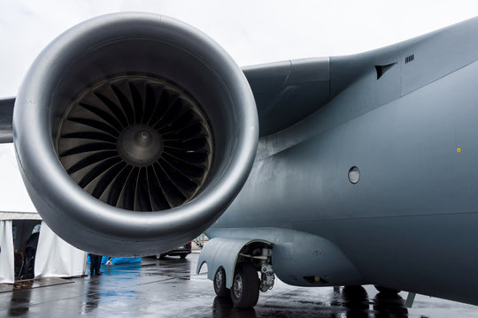
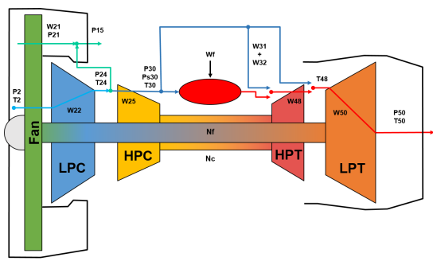

# N-CMAPSS_DL
DL evaluation on N-CMAPSS
Turbo fan engine           |  CMAPSS [[1]](#1)
:----------------------------:|:----------------------:
  |  

---
## Prerequisites
Python Version: 3.10+

---
### Preferable to install Pyenv for package version management
```commandline
# Skip to last line (installing requirements) if not using pyenv
sudo apt install pyenv

pyenv install 3.10
pyenv virtualenv 3.10 py310_ncmapss
pyenv rehash
pyenv activate py310_ncmapss
pip install --upgrade pip setuptools
```
### Irrespective of pyenv, clone this repo and install the below requirements
```
pip3 install -r requirements.txt
```
---
## Sample creator
Following the below instruction, you can create training/test sample arrays for machine learning model (especially for DL architectures that allow time-windowed data as input) from NASA's N-CMAPSS datafile. <br/>
Please download Turbofan Engine Degradation Simulation Data Set-2, so called N-CMAPSS dataset [[2]](#2), from [NASA's prognostic data repository](https://ti.arc.nasa.gov/tech/dash/groups/pcoe/prognostic-data-repository/). In case the link does not work, please temporarily use this [shared drive](https://drive.google.com/drive/folders/1HtnDBGhMoAe53hl3t1XeCO9Z8IKd3-Q-)
<br/>

This repo uses 9 datasets from the above shared drive.

Extract and place it parallel to the `N-CMAPSS_DL` directory in a directory named `dataset`
```commandline
|dataset
  |N-CMAPSS_DS01-005.h5
  |N-CMAPSS_DS02-006.h5
  | ... so on
|N-CMAPSS_DL 
  |README.md
  |sample_creator_unit_auto.py
  |inference_cnn_aggr.py 
  | ... and so on
```

#### *DS008d-...* from the above drive seems to be corrupted. It is alright to ignore this sub dataset.
We remain with 9 datasets: 
```python
Datasets = ['N-CMAPSS_DS02-006', 'N-CMAPSS_DS07', 'N-CMAPSS_DS06', 'N-CMAPSS_DS01-005', 'N-CMAPSS_DS05',
             'N-CMAPSS_DS03-012', 'N-CMAPSS_DS08c-008', 'N-CMAPSS_DS08a-009', 'N-CMAPSS_DS04',]
```
 
In the downloaded dataset, dataset DS01 has been used for the application of model-based diagnostics and dataset DS02 has been used for data-driven prognostics. However, here we use all of them.   <br/>

---
## Step 1: Generate the .npz files (numpy compressed files) for all the 9 datasets. (7 is good enough)
This includes the sampled, scaled, time series representation of the Xs (Physical sesnors) in the .h5 datasets
```bash
# For train engine units
python3 sample_creator_unit_auto.py -w 50 -s 1 --test 0 --sampling 10
# For test engine units
python3 sample_creator_unit_auto.py -w 50 -s 1 --test 1 --sampling 10
```
&ndash;  w : window length <br/>
&ndash;  s : stride of window <br/>
&ndash;  test : select train or test, if it is zero, then the code extracts samples from the engines used for training. Otherwise, it creates samples from test engines<br/>
&ndash;  sampling : subsampling the data before creating the output array so that we can set assume different sampling rate to mitigate memory issues. 

Train and Test Units are already Divided in the .h5 files itself. 
Summary:</br>

|                      Dataset                       | Train/Dev                                                              | Test                                                          |
|:--------------------------------------------------:|:-----------------------------------------------------------------------|:--------------------------------------------------------------|
|                N-CMAPSS_DS01-005.h5                | 1. 2. 3. 4. 5. 6.                                                      | 7.  8.  9. 10.                                                |
|                N-CMAPSS_DS02-006.h5                | 2.  5. 10. 16. 18. 20.                                                 | 11. 14. 15.                                                   |
|                N-CMAPSS_DS03-012.h5                | 1. 2. 3. 4. 5. 6. 7. 8. 9.                                             | 10. 11. 12. 13. 14. 15.                                       |
|                  N-CMAPSS_DS04.h5                  | 1. 2. 3. 4. 5. 6.                                                      | 7.  8.  9. 10.                                                |
|                  N-CMAPSS_DS05.h5                  | 1. 2. 3. 4. 5. 6.                                                      | 7.  8.  9. 10.                                                |
|                  N-CMAPSS_DS06.h5                  | 1. 2. 3. 4. 5. 6.                                                      | 7.  8.  9. 10.                                                |
|                  N-CMAPSS_DS07.h5                  | 1. 2. 3. 4. 5. 6.                                                      | 7.  8.  9. 10.                                                |
|               N-CMAPSS_DS08a-009.h5                | 1. 2. 3. 4. 5. 6. 7. 8. 9                                              | 10. 11. 12. 13. 14. 15.                                       |
|               N-CMAPSS_DS08c-008.h5                | 1. 2. 3. 4. 5. 6.                                                      | 7.  8.  9. 10.                                                |

The size of the dataset is significantly large and it can cause memory issues by excessive memory use. Considering memory limitation that may occur when you load and create the samples, we set the data type as 'np.float32' to reduce the size of the data while the data type of the original data is 'np.float64'. Based on our experiments, this does not much affect to the performance when you use the data to train a DL network. If you want to change the type, please check 'data_preparation_unit.py' file in /utils folder.  <br/>

In addition, we offer the data subsampling to handle 'out-of-memory' issues from the given dataset that use the sampling rate of 1Hz. When you set this subsampling input as 10, then it indicates you only take only 1 sample for every 10, the sampling rate is then 0.1Hz. 

Finally, you will have a npz file for each engine of each dataset in ./N-CMAPSS/Samples_whole folder. <br/>

Each compressed file contains two arrays with different labels: 'sample' and 'label'. In the case of the test units, 'label' indicates the ground truth RUL of the test units for evaluation. 

For instance, one of the created file, Unit2_win50_str1_smp10.npz, its filename indicates that the file consists of a collection of the sliced time series by time window size 50 from the trajectory of engine (unit) 2 with the sampling rate of 0.1Hz. <br/>

---
# Step 2: Run/Train the Model

Models are picked from ```dnn.py```, you can even write your own custom models there.


```bash
# Run with the default mode
python3 inference_cnn_aggr.py

# Special arguments added
python3 inference_cnn_aggr.py -skip 10 # For each RUL of an engine, skip the first 10% and last 10% of samples
# This ^ was added because when a flight is in cruise mode, RUL predictions were more accurate than during takeoff/ landing

python3 inference_cnn_aggr.py -eval_critical_ruls
# Evaluates the lower half of RULs only. Predictions were much better as RUL--> 0 than during full health

python3 inference_cnn_aggr.py -only_eval_model Models/<h5 model name>
# Use a trained model to run inference on Test units, and get a score.
```
---
## Useful Information

Models will be generated in the ```Models/``` directory. It will be named ```model.h5``` by default </br>
Training curves and test engine inference Figures will be generated in the ```Figures/``` directory. </br>

---
 Additionally, two more useful edits can be done in the ```inference_cnn_aggr.py``` code </br> 
1. ```filenames = ``` declaration can be changed if you need the model to be trained/evaluated on custom datasets.
2. If you also want to train models separately based on Flight Class, you can edit the csv path in: ```file_devtest_df = pd.read_csv("File_DevUnits_TestUnits.csv")```. 
   1. For Class 1 (short duration): choose ```File_DevUnits_TestUnits_class1.csv```
   2. For Class 2 (medium duration): choose ```File_DevUnits_TestUnits_class2.csv```
   3. For Class 3 (long duration): choose ```File_DevUnits_TestUnits_class3.csv```
---

---

# Experimental Findings

Note: Data Samples were all taken with Window length 50, all 20 sensors. Window stride of 1, and subsampling stride of 10.</br>
So samples were of dimensions `(no_of_samples, window_length, no_of sensors) = (?,50,20)`

1. Different Loss Functions have been tried out. `MSLE`, `NASAScore`, `Huber`, `MSE`. 
   1. `NASAScore` is a custom written LossFunction. Refer [[2]](#2) for the formula
   2. However `MSE` turned out to be the best Loss function. Though others are marginally worse. </br>
Model(GRU+CNN+FC)  considered here was of `16.4M FLOPS` . 
   
| Loss Function |  RMSE  | NASA Score |
|:--------------|:------:|:----------:|
| Huber         |  7.93  |    1.13    |
| NASAScore     |  7.82  |    1.05    |
| MSLE          |  7.51  |    0.88    |
| **MSE**       | `6.38` |   `0.71`   |


2. Despite the fact that samples were randomly shuffled across engines, across datasets, RUL predictions for the lower half (~50->0) were significantly more accurate than the predictions for higher RULs (100->~50). </br>
Model(GRU+CNN+FC) considered here was of `49.6M FLOPS` 

| RUL span for each engine |  RMSE  | NASA Score |
|:-------------------------|:------:|:----------:|
| Whole dataset            | 11.16  |    2.09    |
| First Half               | 13.69  |    2.67    |
| **Second Half**          | `9.94` |   `1.73`   |

3. Across, different flight classes, `Flight Class 1` was subsequently easy to predict, despite having the least number of samples. `Flight Class 2, Flight Class 3 `were harder to predict accurately. </br>
Nevertheless, a single model was used for all the three classes. But it showcases that it can be a good idea to develop flight class based models. </br> 
Model(GRU+CNN+FC) considered here was of `49.6M FLOPS` 

| Flight Class | No. of inference Samples | RMSE  | NASA Score |
|:-------------|--------------------------|:-----:|:----------:|
| 1            | 15973                    | 8.39  |    0.87    |
| 2            | 31572                    | 9.76  |    1.38    |
| 3            | 42274                    | 10.58 |    2.31    |

4. Across different models, two datasets performed outrageously worse compared to the rest 7. For subsequent model training and development, these datasets weren't considered.
   1. N-CMAPSS_DS04.h5
   2. N-CMAPSS_DS08a-009.h5 </br>
Here, `Model A -49.6M FLOPS`, `Model B- 12.4M FLOPS`. Both were (GRU+CNN+FC).
   
| Dataset                   | RMSE (Model A) | NASA Score (Model A) | RMSE (Model B) | NASA Score (Model B) |
|:--------------------------|:--------------:|:--------------------:|:--------------:|:--------------------:|
| N-CMAPSS_DS01-005.h5      |      5.66      |         0.44         |      7.69      |         0.79         |
| N-CMAPSS_DS02-006.h5      |      3.88      |         0.28         |      2.97      |         0.19         |
| N-CMAPSS_DS03-012.h5      |      3.64      |         0.30         |      4.16      |         0.35         |
| **N-CMAPSS_DS04.h5**      |    `15.92`     |        `3.80`        |     `14.7`     |        `3.04`        |
| N-CMAPSS_DS05.h5          |      4.07      |         0.32         |      3.32      |         0.27         |
| N-CMAPSS_DS06.h5          |      3.8       |         0.31         |      4.23      |         0.34         |
| N-CMAPSS_DS07.h5          |      5.5       |         0.59         |      7.1       |         0.89         |
| **N-CMAPSS_DS08a-009.h5** |    `15.97`     |        `4.11`        |    `18.31`     |        `6.62`        |
| N-CMAPSS_DS08c-008.h5     |      4.27      |         0.34         |      4.31      |         0.33         |

5. A single flight from point A to B is one life, i.e one RUL gets decreased. Now, a single flight consists of ascent, cruise and descent. In an effort to figure out to improvise predictions, I figured that initial ascent and last moments of descent contributed to a lot of noise in the predictions. </br>
So an approach was to avoid these parts of the flight to make better predictions. So, a `-skip` feature was introduced. Say `-skip 5` means skip first 5% and last 5% of a flight duration's samples. </br>
Using `N-CMAPSS_DS02-006.h5` and a Model (GRU+CNN+FC) of 10.6M FLOPS:

| % of samples skipped | No. of Training Samples | No. of inference Samples | RMSE | NASA Score |
|:---------------------|:-----------------------:|:------------------------:|:----:|:----------:|
| 0                    |          52608          |          12524           | 8.19 |    0.8     |
| 10                   |          42101          |          10036           | 6.44 |    0.59    |
| 15                   |          36868          |           8786           | 7.69 |    0.74    |
| 20                   |          31603          |           7532           | 5.99 |    0.53    |
| 30                   |          21084          |           5029           | 8.47 |    0.94    |

Seems like 10% is a sweet spot. Although 20% has better numbers, it also means a very big chunk of the data is getting skipped, so not preferred.


6. With the above learnings, 
   1. After excluding two datasets as mentioned above
   2. and predicting only the critical RULs (second half)
   3. Skipping 15% of the beginning and end samples for every RUL </br>
   
   Model using GRU+CNN+FC of `10.6M FLOPS` gave the following results: </br>
   In my opinion, these results are really good! To be able to predict within 5 cycles of the actual RUL is amazing. 

| FLOPS | No. of Training Samples | No. of inference Samples | RMSE | NASA Score |
|-------|-------------------------|--------------------------|:----:|:----------:|
| 10.6M | 231192                  | 64158                    | 4.98 |    0.47    |

7. A much smaller model `deepgrucnnfc`, `transformer` in `dnn.py` which had just `3.07M FLOPS` yielded the following results.
All 7 datasets were taken with 10% of data being skipped, evaluated on critical RULs.

| Model        | FLOPS | No. of Training Samples | No. of inference Samples | RMSE | NASA Score |
|--------------|:------|:-----------------------:|:------------------------:|:----:|:----------:|
| deepgrucnnfc | 3.07M |         264143          |          73308           | 5.16 |    0.48    |
| transformer  | 1.12M |         264143          |          73308           | 4.68 |    0.41    |


8. The following experiment was about comparing newer architectures, 10% skip, on DS02 dataset only

| Model                 | FLOPS  | RMSE (full DS02) | NASA Score (full DS02) | RMSE (critical RULs) | NASA Score (critical RULs) |
|:----------------------|:------:|:----------------:|------------------------|:--------------------:|:--------------------------:|
| Mobilenetv2           | 19.7M  |       8.09       | 0.88                   |         4.61         |            0.35            |
| transformer (smaller) | 0.552M |       7.09       | 0.70                   |         3.6          |            0.26            |

9. Overall, by just comparing the main models for inference speed, RMSE, NASA Score

Evaluation time per sample on GTX 1080 Ti

| Model           | FLOPS | Inference time per sample |
|-----------------|:------|:-------------------------:|
| largestcudnngru | 49.6M |          3.21ms           |
| grucnndc        | 10.6M |          1.49ms           |
| deepgrucnnfc    | 3.07M |          1.73ms           |
| transformer     | 1.12M |          1.33ms           |

### RMSE across engines

| Filename               | Engine Unit | RMSE_largestcudnngru | RMSE_grucnndc | RMSE_deepgrucnnfc | RMSE_transformer |
|:-----------------------|------------:|---------------------:|--------------:|------------------:|-----------------:|
| N-CMAPSS_DS01-005      |           7 |                11.21 |           7.3 |              9.01 |             8.54 |
| N-CMAPSS_DS01-005      |           8 |                 4.44 |          5.31 |              3.95 |             3.12 |
| N-CMAPSS_DS01-005      |           9 |                15.45 |          9.77 |              12.4 |            12.29 |
| N-CMAPSS_DS01-005      |          10 |                  3.4 |          3.94 |              2.76 |             1.96 |
| N-CMAPSS_DS02-006      |          11 |                 3.43 |          4.14 |              4.78 |                4 |
| N-CMAPSS_DS02-006      |          14 |                 2.87 |          3.62 |              6.14 |             3.89 |
| N-CMAPSS_DS02-006      |          15 |                 2.15 |          2.24 |              3.06 |             3.11 |
| N-CMAPSS_DS03-012      |          10 |                 4.18 |          3.97 |              3.34 |             3.16 |
| N-CMAPSS_DS03-012      |          11 |                 2.32 |          2.75 |               2.3 |             2.38 |
| N-CMAPSS_DS03-012      |          12 |                 7.53 |          8.31 |              7.33 |             7.06 |
| N-CMAPSS_DS03-012      |          13 |                  4.1 |          3.79 |              3.97 |             3.89 |
| N-CMAPSS_DS03-012      |          14 |                 3.54 |          3.13 |              3.13 |             2.96 |
| N-CMAPSS_DS03-012      |          15 |                 2.61 |          3.07 |              2.08 |             2.02 |
| N-CMAPSS_DS05          |           7 |                 4.42 |          4.65 |              4.91 |             4.21 |
| N-CMAPSS_DS05          |           8 |                 3.12 |          2.89 |              2.52 |             2.73 |
| N-CMAPSS_DS05          |           9 |                 2.03 |          2.95 |              3.14 |              3.9 |
| N-CMAPSS_DS05          |          10 |                  3.5 |          4.04 |              4.44 |             4.16 |
| N-CMAPSS_DS06          |           7 |                 6.42 |          4.94 |              4.17 |             3.98 |
| N-CMAPSS_DS06          |           8 |                 4.22 |          7.14 |              6.36 |              4.6 |
| N-CMAPSS_DS06          |           9 |                 2.63 |          2.61 |              2.03 |             3.37 |
| N-CMAPSS_DS06          |          10 |                  2.5 |          3.63 |              2.73 |             2.55 |
| N-CMAPSS_DS07          |           7 |                 2.49 |          3.91 |              3.71 |             2.87 |
| N-CMAPSS_DS07          |           8 |                 5.35 |          3.41 |                 3 |             3.81 |
| N-CMAPSS_DS07          |           9 |                 9.47 |          9.33 |               9.6 |             8.49 |
| N-CMAPSS_DS07          |          10 |                 3.32 |          3.75 |              3.07 |             3.56 |
| N-CMAPSS_DS08c-008     |           7 |                 4.28 |          5.12 |              5.04 |             5.27 |
| N-CMAPSS_DS08c-008     |           8 |                 2.66 |          3.07 |              3.13 |             3.05 |
| N-CMAPSS_DS08c-008     |           9 |                 2.64 |          3.06 |              3.46 |             3.39 |
| N-CMAPSS_DS08c-008     |          10 |                  6.6 |          8.33 |              9.86 |             5.54 |
| **Ignorable Section:** |
| N-CMAPSS_DS04          |           7 |                24.61 |         12.42 |             17.75 |            11.29 |
| N-CMAPSS_DS04          |           8 |                 7.55 |         21.15 |             22.77 |            13.83 |
| N-CMAPSS_DS04          |           9 |                16.21 |         11.11 |             13.54 |             7.64 |
| N-CMAPSS_DS04          |          10 |                 6.65 |         18.49 |             20.97 |              9.6 |
| N-CMAPSS_DS08a-009     |          10 |                 4.17 |         24.51 |             24.93 |            26.07 |
| N-CMAPSS_DS08a-009     |          11 |                 6.73 |         27.92 |             29.79 |            27.27 |
| N-CMAPSS_DS08a-009     |          12 |                31.95 |         46.13 |             58.67 |            61.16 |
| N-CMAPSS_DS08a-009     |          13 |                  4.1 |         25.13 |             25.23 |            22.08 |
| N-CMAPSS_DS08a-009     |          14 |                15.13 |         31.73 |             30.61 |            20.48 |
| N-CMAPSS_DS08a-009     |          15 |                20.54 |         49.93 |             57.33 |            62.29 |

### NASA Scores across engines

| Filename               | Engine Unit | NASAScore_largestcudnngru | NASAScore_grucnndc | NASAScore_deepgrucnnfc | NASAScore_transformer |
|:-----------------------|------------:|--------------------------:|-------------------:|-----------------------:|----------------------:|
| N-CMAPSS_DS01-005      |           7 |                      1.33 |               0.66 |                   0.93 |                  0.81 |
| N-CMAPSS_DS01-005      |           8 |                      0.47 |               0.59 |                   0.37 |                  0.33 |
| N-CMAPSS_DS01-005      |           9 |                      2.51 |               1.06 |                   1.62 |                  1.55 |
| N-CMAPSS_DS01-005      |          10 |                      0.31 |               0.36 |                   0.22 |                  0.17 |
| N-CMAPSS_DS02-006      |          11 |                      0.22 |               0.29 |                   0.38 |                  0.31 |
| N-CMAPSS_DS02-006      |          14 |                      0.19 |               0.26 |                   0.52 |                  0.27 |
| N-CMAPSS_DS02-006      |          15 |                      0.14 |               0.14 |                   0.21 |                  0.21 |
| N-CMAPSS_DS03-012      |          10 |                      0.31 |                0.3 |                   0.24 |                  0.24 |
| N-CMAPSS_DS03-012      |          11 |                      0.14 |               0.19 |                   0.14 |                  0.16 |
| N-CMAPSS_DS03-012      |          12 |                      1.05 |               1.23 |                   0.99 |                  0.94 |
| N-CMAPSS_DS03-012      |          13 |                       0.4 |               0.35 |                    0.4 |                  0.39 |
| N-CMAPSS_DS03-012      |          14 |                      0.23 |               0.25 |                    0.2 |                  0.18 |
| N-CMAPSS_DS03-012      |          15 |                      0.15 |               0.23 |                   0.13 |                  0.12 |
| N-CMAPSS_DS05          |           7 |                      0.46 |               0.51 |                   0.56 |                  0.43 |
| N-CMAPSS_DS05          |           8 |                      0.27 |               0.21 |                   0.18 |                  0.21 |
| N-CMAPSS_DS05          |           9 |                      0.14 |               0.22 |                   0.23 |                   0.3 |
| N-CMAPSS_DS05          |          10 |                      0.24 |               0.32 |                   0.35 |                  0.32 |
| N-CMAPSS_DS06          |           7 |                      0.59 |               0.43 |                   0.35 |                  0.31 |
| N-CMAPSS_DS06          |           8 |                      0.45 |               0.89 |                    0.9 |                  0.52 |
| N-CMAPSS_DS06          |           9 |                      0.19 |                0.2 |                   0.15 |                  0.25 |
| N-CMAPSS_DS06          |          10 |                      0.19 |               0.32 |                   0.26 |                  0.21 |
| N-CMAPSS_DS07          |           7 |                       0.2 |               0.37 |                   0.36 |                  0.23 |
| N-CMAPSS_DS07          |           8 |                      0.39 |               0.25 |                   0.21 |                  0.26 |
| N-CMAPSS_DS07          |           9 |                      1.53 |               1.52 |                   1.58 |                  1.28 |
| N-CMAPSS_DS07          |          10 |                      0.27 |               0.39 |                   0.29 |                  0.31 |
| N-CMAPSS_DS08c-008     |           7 |                      0.33 |               0.41 |                   0.39 |                  0.42 |
| N-CMAPSS_DS08c-008     |           8 |                      0.23 |               0.27 |                   0.27 |                  0.28 |
| N-CMAPSS_DS08c-008     |           9 |                       0.2 |               0.26 |                   0.27 |                  0.29 |
| N-CMAPSS_DS08c-008     |          10 |                      0.56 |               0.83 |                   1.11 |                  0.43 |
| **Ignorable Section:** |
| N-CMAPSS_DS04          |           7 |                      8.55 |               2.73 |                   6.16 |                  2.17 |
| N-CMAPSS_DS04          |           8 |                      0.81 |               6.14 |                   9.87 |                  3.17 |
| N-CMAPSS_DS04          |           9 |                      3.03 |               1.73 |                    3.2 |                  0.96 |
| N-CMAPSS_DS04          |          10 |                      0.77 |               4.26 |                   6.16 |                  1.37 |
| N-CMAPSS_DS08a-009     |          10 |                      0.38 |              11.64 |                    8.9 |                 12.23 |
| N-CMAPSS_DS08a-009     |          11 |                      0.58 |              11.38 |                  14.68 |                 15.48 |
| N-CMAPSS_DS08a-009     |          12 |                     20.01 |              59.66 |                 135.67 |                193.11 |
| N-CMAPSS_DS08a-009     |          13 |                       0.3 |               8.71 |                   9.52 |                  8.29 |
| N-CMAPSS_DS08a-009     |          14 |                      5.75 |              14.29 |                  15.22 |                  6.13 |
| N-CMAPSS_DS08a-009     |          15 |                      4.14 |              75.27 |                 101.07 |                171.29 |

## References
<a id="1">[1]</a> 
Frederick, Dean & DeCastro, Jonathan & Litt, Jonathan. (2007). User's Guide for the Commercial Modular Aero-Propulsion System Simulation (C-MAPSS). NASA Technical Manuscript. 2007–215026. 

<a id="2">[2]</a> 
Chao, Manuel Arias, Chetan Kulkarni, Kai Goebel, and Olga Fink. "Aircraft Engine Run-to-Failure Dataset under Real Flight Conditions for Prognostics and Diagnostics." Data. 2021; 6(1):5. https://doi.org/10.3390/data6010005

<a id="3">[3]</a> 
Chao, Manuel Arias, Chetan Kulkarni, Kai Goebel, and Olga Fink. "Fusing physics-based and deep learning models for prognostics." Reliability Engineering & System Safety 217 (2022): 107961.

<a id="3">[4]</a> 
Mo, Hyunho, and Giovanni Iacca. "Multi-objective optimization of extreme learning machine for remaining useful life prediction." In Applications of Evolutionary Computation: 25th European Conference, EvoApplications 2022, Held as Part of EvoStar 2022, Madrid, Spain, April 20–22, 2022, Proceedings, pp. 191-206. Cham: Springer International Publishing, 2022.

## Acknowledgement

This repo has been built on top of Hyunho Mo's amazing <a id="https://github.com/mohyunho/N-CMAPSS_DL/tree/main">repo</a>. Please do check it out and give a star! https://github.com/mohyunho/N-CMAPSS_DL/tree/main

